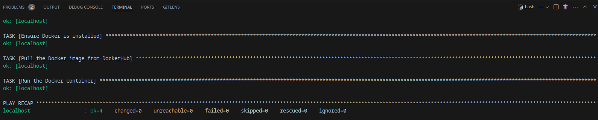

## Note-App

This repository hosts a simple web application for managing notes using Flask.


### Features

   - Add new notes.
   - View the list of notes.
   - Delete notes from the list.

### Prerequisites

  Before running the application, ensure you have the following installed:

   - Python 3.11
   - Flask 2.0.2 (install via `pip install Flask`)
   - pytest 8.2.2 (install via `pip install pytest`)

### Installation

1. **Clone the repository and navigate to the project directory:**

   ```bash
   git clone https://github.com/bassma-khaled14/Note-App.git
   cd Note-App
   ```

2. **Set up a virtual environment:**

   Create and activate a virtual environment to manage dependencies:

   ```bash
   python3 -m venv venv
   ````
   **On Linux:**
   ````bash
   source venv/bin/activate
   ````
   **On Windows:**
   ````bash
   venv\Scripts\activate
   ````

3. **Install dependencies:**

   Use `pip` to install required packages listed in requirements.txt:

     ```bash
   pip install -r requirements.txt
     ```
   Set up Docker on your machine
      ```bash
      sudo apt-get update
      sudo apt install docker.io docker-compose docker-buildx
      ```
   Test Docker 
      ```bash
      sudo groupadd docker
      docker run hello-world
      ```
   Make sure that Docker service is enabled 
      ```bash
      sudo systemctl status docker
      ```
   If It's not enabled
      ```bash
      sudo systemctl enable docker
      ```
### Usage
   1. **Run the application:**
      Start the Flask server to run the application locally:
      ```bash
      Flask run
      ```
      The application will be accessible at `http://localhost:5000`.
### Tests
   1. **Run test:**
   
      Use `pytest` to execute the test suite for the application:
      ````bash
      pytest
      ````
      This ensures all functionalities are working correctly.
### Folder Structure
````bash
notes_app/
     │
     ├── app.py                 # Main Flask application file
     ├── templates/             # HTML templates (separation of concerns)
     │   └── index.html         # Main page template
     ├── test_app.py            # Test suite for the application
     ├── venv/                  # Virtual environment folder (ignored in .gitignore)
     └── requirements.txt       # List of dependencies
````
### Best Practices Followed
   - **Virtual Environment**: Utilization of `venv` for package management, ensuring a clean environment isolated from system-wide Python packages.
   - **Separation of Concerns**: HTML templates are stored in the `templates/` directory, maintaining separation between front-end and back-end logic.
   - **Testing**: Integration of automated tests (`pytest`) to verify application functionality, ensuring reliability and consistency.
### Running the application in Docker
   1. **Login With Docker**
   ````bash
      docker login username
   ````
  enter your username on dockerhub
   
   2. **Pull Image From DockerHub**
    
   ````bash
      docker pull bassma/flasknoteapp
   ````
   3. **Run Docker Container**
   ````bash
      docker run -p 5000:5000 --name appcontainer bassma/flasknoteapp
   ````
  
application will be accessible at http://127.0.0.1:5000
   
### Run the application with an nginx webserver 
   ```bash
   docker-compose up --build
   ```
### Ansible Playbook for Docker Deployment 
This Ansible playbook deploys a Docker container from DockerHub. It performs the following steps:

- **Ensure Docker is installed**
- **Pull the Docker image from DockerHub**
- **Run the Docker container**

### Running the Playbook ###

**1.** **Ensure Ansible is installed:**
```bash
pip install ansible
```
**2.** **Run the playbook:**

```bash
ansible-playbook -i localhost, --connection=local --ask-become-pass deploy.yml
```
**screenshot of ansbile-playbook after run command**


